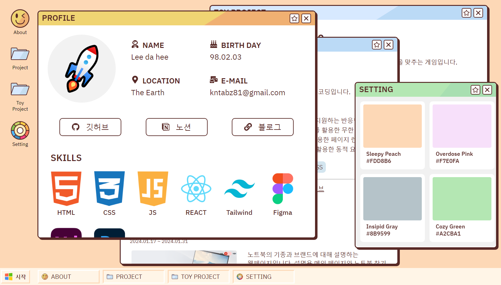

# Portfolio

### 🔗링크
https://08intro.netlify.app/

### 🔎소개
제작한 웹페이지를 소개하는 포트폴리오 웹페이지입니다.
윈도우98 UI 디자인을 참고하여 제작했습니다.

### 📅제작 기간
2024.02.01 ~ 2024.02.14

### 🗂개발 환경
- React-Vite

### 🎈주요 기능
- 모바일, 태블릿, PC 화면을 지원하는 반응형 디자인
- react-draggable을 활용한 드래그 가능한 모달
- Framer motion로 만든 동적 요소

### ✔ 미리보기

[Icon image by pikisuperstar on Freepik
](https://www.freepik.com/free-vector/hand-drawn-retro-computer-windows-element_41099709.htm#page=2&query=retro%20ui%20kit&position=33&from_view=keyword&track=ais&uuid=67d3ce04-85d6-4c54-beac-bfd2986da798)
